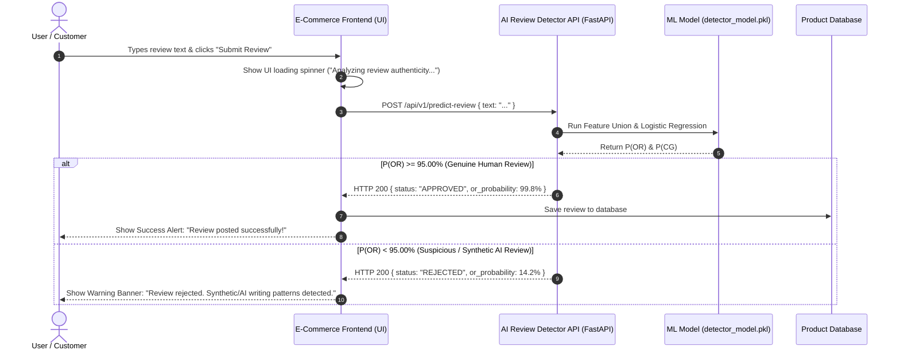

# End-to-End Integration Guide: AI-Generated Review Detection in E-Commerce Platform

> **Goal**: Real-time integration of the trained **95% Threshold AI Review Detector (`detector_model.pkl`)** into a modern E-Commerce website to automatically intercept, evaluate, approve genuine human reviews, and reject synthetic/AI-generated reviews prior to database insertion.

---

## 1. Executive Summary & Recommended Deployment Strategy

To integrate your trained machine learning model into a web application, **you cannot run `.pkl` models directly inside browser JavaScript**. JavaScript in the browser cannot execute Python code or deserialize `joblib` objects.

Instead, the standard professional architecture is a **Decoupled API Architecture**:

```
┌──────────────────────────┐      HTTP POST /api/v1/predict      ┌──────────────────────────┐
│   E-Commerce Web App     │ ───────────────────────────────────► │  AI Review Detector API  │
│ (React / Vue / HTML+JS)  │ ◄─────────────────────────────────── │   (FastAPI / HF Space)   │
└──────────────────────────┘      JSON { status, confidence }     └──────────────────────────┘
```

---

## 2. Model Hosting & Deployment Options Comparison

| Option | Hosting Platform | How It Works | Best Used For | Cost | Effort |
| --- | --- | --- | --- | --- | --- |
| **Option A: FastAPI Local / Self-Hosted** ⭐ *(Recommended for Local Demo)* | Local Machine or VPS (Render / Railway / Docker) | FastAPI server loads `detector_model.pkl` into memory once at startup. Exposes REST API at `http://localhost:8000/predict`. | **Local development, portfolio demonstrations, and fast latency (<10ms).** | **100% Free** | Low (5 mins) |
| **Option B: Hugging Face Spaces** ⭐ *(Recommended for Public Web Demo)* | Hugging Face Spaces (CPU Basic) | Upload model + FastAPI app to HF. HF provides a public HTTPS endpoint (`https://user-space.hf.space/predict`). | **Free public web hosting for portfolio links & external access.** | **100% Free** | Low (10 mins) |
| **Option C: AWS Lambda / Serverless** | AWS Lambda + API Gateway | Serverless function spins up per request and predicts text. | **High-scale enterprise production.** | Pay per request | Medium-High |

### Recommendation for Your Project:
* **For Local Demo**: Use **Option A (FastAPI)**. It runs in under 1 second on your machine with near-zero latency.
* **For Sharing Online**: Deploy to **Option B (Hugging Face Spaces)** for a free, permanent public URL.

---

## 3. Full End-to-End System Architecture



---

## 4. Step-by-Step API Implementation Guide (FastAPI)

### Step 4.1: Create the FastAPI Application (`app.py`)

Create a lightweight REST API wrapper that loads the model checkpoint once during server startup:

```python
"""
FastAPI Server Wrapper for AI Review Detection System
File: app.py
"""

from fastapi import FastAPI, HTTPException
from fastapi.middleware.cors import CORSMiddleware
from pydantic import BaseModel, Field
from pathlib import Path
import sys

# Add project root to sys.path
PROJECT_ROOT = Path(__file__).resolve().parent
sys.path.insert(0, str(PROJECT_ROOT))

from src.predictor import ReviewDetectorPredictor

app = FastAPI(
    title="AI Review Detector API",
    description="Real-time review classification using 95% OR Probability Rule",
    version="1.0.0"
)

# Enable CORS for frontend integration
app.add_middleware(
    CORSMiddleware,
    allow_origins=["*"],  # Adjust allowed domains in production
    allow_credentials=True,
    allow_methods=["*"],
    allow_headers=["*"],
)

# Load ML Predictor on server startup
MODEL_PATH = PROJECT_ROOT / "models" / "detector_model.pkl"
predictor = ReviewDetectorPredictor(model_path=MODEL_PATH)

class ReviewRequest(BaseModel):
    text: str = Field(..., min_length=5, description="The review text submitted by the user")

class ReviewResponse(BaseModel):
    status: str            # "APPROVED" or "REJECTED"
    prediction_class: int  # 0 for OR, 1 for CG
    label: str             # Human vs AI
    confidence: float      # Confidence percentage
    or_probability: float  # OR Probability
    cg_probability: float  # CG Probability
    message: str           # User-facing explanation

@app.get("/")
def health_check():
    return {"status": "online", "model_loaded": True}

@app.post("/api/v1/predict-review", response_model=ReviewResponse)
def evaluate_review(payload: ReviewRequest):
    try:
        res = predictor.predict(payload.text)
        
        if res['prediction'] == 0:  # P(OR) >= 95.00%
            return ReviewResponse(
                status="APPROVED",
                prediction_class=0,
                label=res['label'],
                confidence=res['confidence'],
                or_probability=res['or_probability'],
                cg_probability=res['cg_probability'],
                message="Review verified as genuine human experience. Approved for publishing."
            )
        else:  # P(OR) < 95.00%
            return ReviewResponse(
                status="REJECTED",
                prediction_class=1,
                label=res['label'],
                confidence=res['confidence'],
                or_probability=res['or_probability'],
                cg_probability=res['cg_probability'],
                message="Review rejected: Deceptive synthetic/AI writing patterns detected."
            )
    except Exception as e:
        raise HTTPException(status_code=500, detail=str(e))
```

### Step 4.2: Running the API Server

```bash
uvicorn app:app --reload --port 8000
```

* API Docs will be available at: `http://localhost:8000/docs`
* Prediction Endpoint: `POST http://localhost:8000/api/v1/predict-review`

---

## 5. E-Commerce Demo Web Application Integration

### Step 5.1: HTML / JavaScript Review Form Submission Code

In your e-commerce demo website, intercept the review submission form using JavaScript `fetch()`:

```javascript
// E-Commerce Review Submission Handler
async function submitProductReview(event) {
    event.preventDefault();

    const reviewInput = document.getElementById("reviewText").value;
    const statusDiv = document.getElementById("statusMessage");
    const submitBtn = document.getElementById("submitBtn");

    // UI Loading state
    submitBtn.disabled = true;
    statusDiv.className = "alert alert-info";
    statusDiv.innerHTML = "🔍 Verifying review authenticity with AI Security Engine...";

    try {
        // 1. Call AI Detector API
        const response = await fetch("http://localhost:8000/api/v1/predict-review", {
            method: "POST",
            headers: { "Content-Type": "application/json" },
            body: JSON.stringify({ text: reviewInput })
        });

        const data = await response.json();

        // 2. Handle Decision Logic
        if (data.status === "APPROVED") {
            statusDiv.className = "alert alert-success";
            statusDiv.innerHTML = `
                ✅ <strong>Review Published!</strong><br/>
                Verification Status: Genuine Human Review (${data.or_probability.toFixed(2)}% Authenticity Score).
            `;
            
            // Append review to live product page UI
            appendReviewToPage(reviewInput, data.or_probability);
            document.getElementById("reviewText").value = "";
        } else {
            statusDiv.className = "alert alert-danger";
            statusDiv.innerHTML = `
                ⛔ <strong>Review Rejected!</strong><br/>
                Our anti-spam engine detected automated/AI-generated phrasing patterns (${data.cg_probability.toFixed(2)}% AI Score).
                Please submit a genuine personal experience.
            `;
        }
    } catch (error) {
        statusDiv.className = "alert alert-warning";
        statusDiv.innerHTML = "⚠️ API Error: Unable to verify review authenticity.";
    } finally {
        submitBtn.disabled = false;
    }
}
```

---

## 6. Real-Time User Experience (UX) Flow & UI Mockup

```
┌────────────────────────────────────────────────────────────────────────┐
│                        SMART AUDIO HEADPHONES                          │
│ ★★★★★ (4.8 / 5 stars based on 1,240 reviews)                           │
├────────────────────────────────────────────────────────────────────────┤
│ LEAVE A CUSTOMER REVIEW:                                               │
│ ┌────────────────────────────────────────────────────────────────────┐ │
│ │ Furthermore, this item is an absolute must-have offering           │ │
│ │ dependable performance for everyday routine usage...               │ │
│ └────────────────────────────────────────────────────────────────────┘ │
│ [ Submit Review ]                                                      │
│                                                                        │
│ ⛔ REGISTRATION REJECTED (AI Guardrail Active)                          │
│ Reason: Synthetic/AI-Generated Text Pattern Detected.                   │
│ Authenticity Confidence Score: 14.2% (Threshold required: >= 95.0%)    │
└────────────────────────────────────────────────────────────────────────┘
```

---

## 7. Complete Development Roadmap

| Phase | Task | Key Deliverable |
| --- | --- | --- |
| **Phase 1: API Setup** | Create `app.py` using FastAPI & test with Swagger UI (`/docs`). | Working local endpoint `http://localhost:8000/api/v1/predict-review` |
| **Phase 2: E-Commerce Demo UI** | Build a sleek HTML/CSS product page with a comment submission form. | Product page UI with interactive review form |
| **Phase 3: Integration** | Connect frontend JS `fetch()` call to the FastAPI endpoint. | Real-time rejection/approval UI banners |
| **Phase 4: Cloud Hosting (Optional)** | Push FastAPI container to Hugging Face Spaces or Render. | Public live shareable demo link |

---

## Summary of Answers to User Questions

1. **Can I directly use this model in an E-Commerce site?**  
   **Yes!** By wrapping `detector_model.pkl` in a FastAPI microservice (`app.py`), your e-commerce frontend can make a lightning-fast HTTP API request (`<10ms`) for every submitted review before posting it to your database.

2. **Can I deploy it to Hugging Face or other platforms?**  
   **Yes.** Uploading your FastAPI app and `detector_model.pkl` to a free **Hugging Face Space** gives you a public HTTPS endpoint for web demos.

3. **Which is best and professional?**  
   The **Decoupled REST API pattern** (FastAPI backend + Web frontend) is the industry standard used by companies like Amazon, Shopify, and Stripe for real-time content moderation engines.
